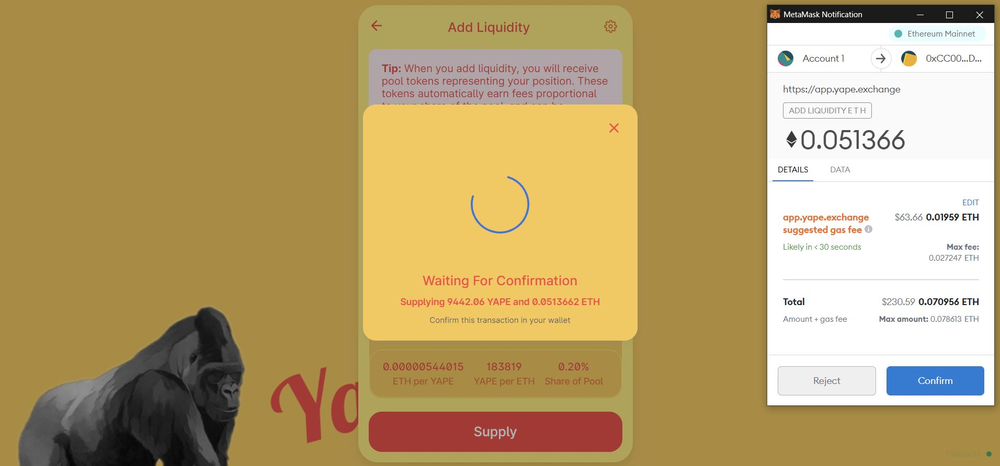
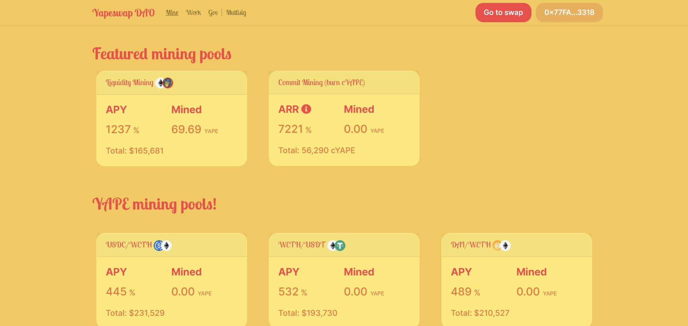
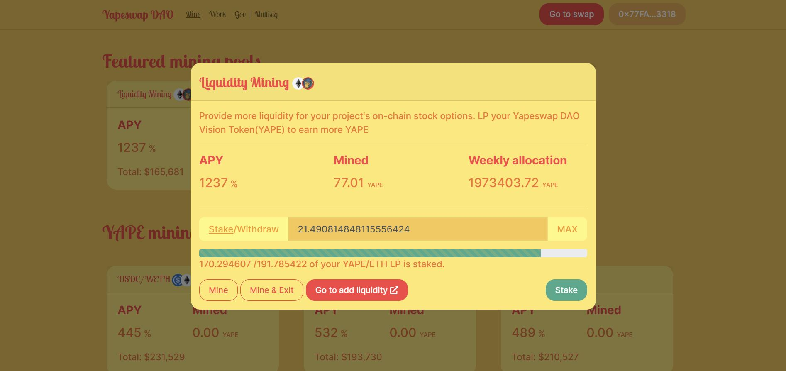
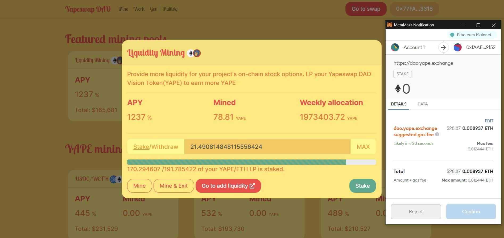
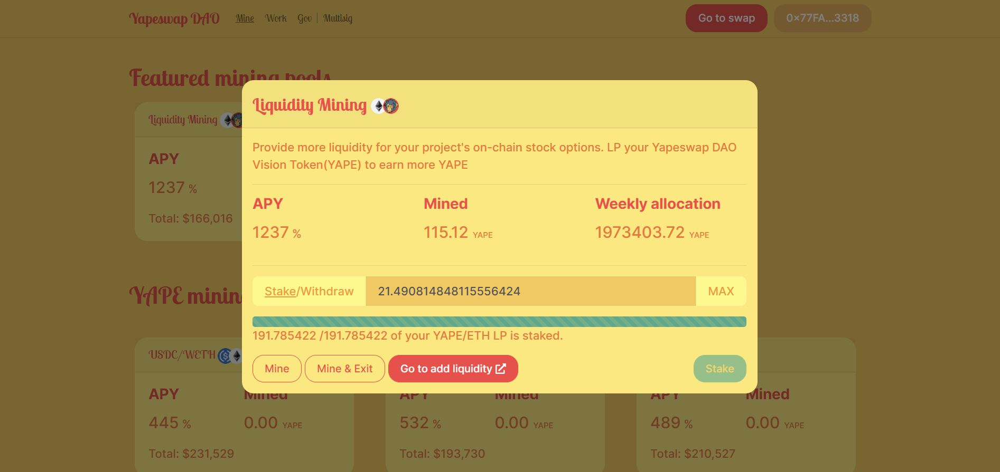

# Supply Liquidity to Yapeswap Pools

Go to yape.exchange and click ENTER APP

In the upper left hand corner click 'pool'

Click 'Add Liquidity' in the corner of the pool window

Select the tokens pair for which you wish to provide liquidity

When determining how much liquidity to add to the pool, be aware that the token pairs must be provided in an even weighting. In other words you must provide an equal amount of each currency as they are currently priced relative to one another. The app will automatically calculate and input the amount of the second currency needed to provide balanced liquidity.

Click 'Add Liquidity'

Confirm that all of the details are correct and click 'Confirm Supply'

Confirm that the transaction has gone through using etherscan. Your funds have been condensed from their original currencies into Yapeswap LP tokens. The ammount of LP tokens you received is a reflection of the value you supplied.

A new window will open with a prompt to ‘Add YLP’ to Metamask, so that you can see the YLP tokens listed under ‘Assets’ in your wallet.

Click ‘Go to DAO’ in the upper corner of the pool page, which will take you to the ‘Mine’ tab.

Select the pool for which you have LP’s in your wallet. Click ‘Stake’ in the lower right corner of the Liquidity Mining window.

Confirm the transaction with your wallet and the balance of the staked LP’s will be reflected.

You may use the same interface to add more liquidity later, or to exit your position. The ‘Mine’ button will withdraw the balance shown under ‘Mined’ above while leaving your staked balance in place to continue earning fees. The ‘Mine & Exit’ Function will withdraw all of your staked balance in addition to any rewards you have accrued.

