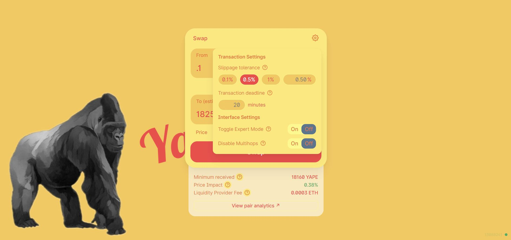
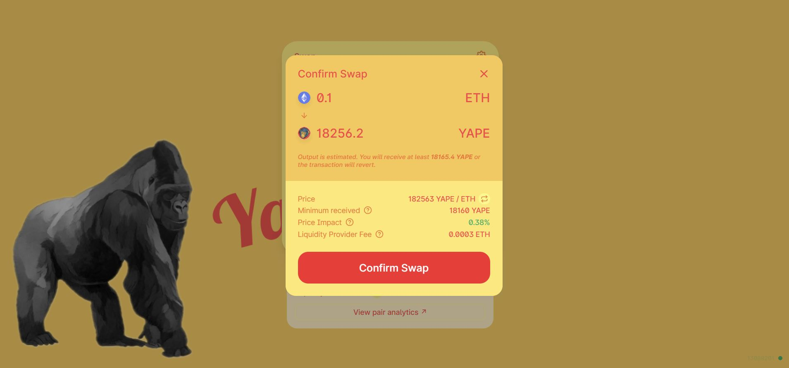

# How to Swap

Go to [https://yape.exchange](https://yape.exchange/) and click ENTER APP or go straight to [https://app.yape.exchange/\#/swap](https://app.yape.exchange/#/swap).

Select the tokens you wish to swap. Click the down arrow between the tokens to toggle the direction of the trade.

Click the gear icon in the upper corner of the swap window to adjust the slippage rate, set a transaction deadine, turn on expert mode, or enable multihops.

Select the amount you wish to swap and click SWAP.

Verify that all of the transaction details are correct and click confirm swap.

Verify that the transaction has gone through using etherscan.

