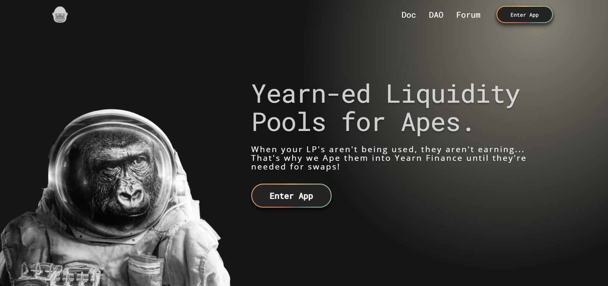
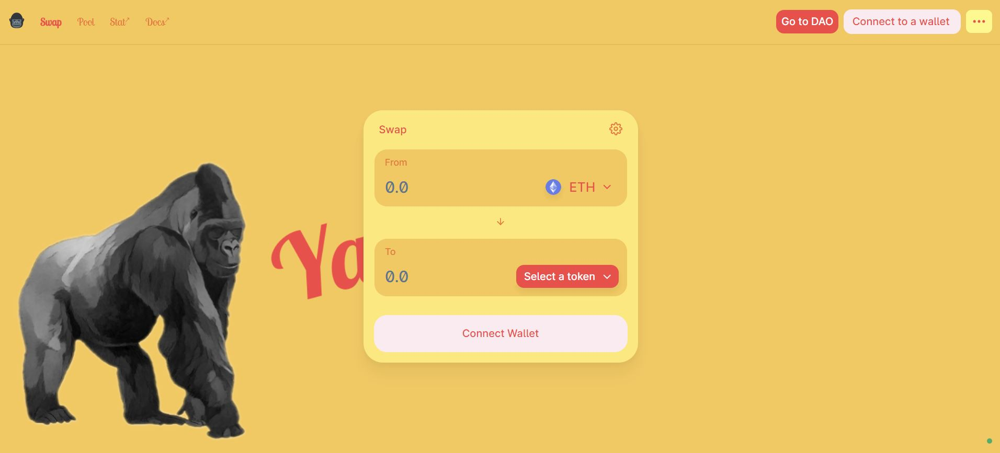

# Getting Started With Yapeswap

Go to yape.exchange to visit the landing page and click on ‘Enter App’

Click on ‘Connect to a wallet’

Select which wallet provider you will be using to connect to the App..jpeg>)

Once connected, you can swap tokens you have in your wallet on the ‘Swap’ tab, acquire LP tokens from the ‘Pool’ tab, and manage your pool positions from the DAO page. You’ll also be able to lock $YAPE for $veYAPE or burn mine with any $cYAPE you’ve received from contributing to the protocol.

If you do not have a decentralized wallet, you will not be able to connect to the Yapeswap dapp.

Please refer to the following guide for more information on how to create a MetaMask wallet.

[The Beginners Guide: How to Use MetaMask (frontierprotocols.com)](https://frontierprotocols.com/how-to-use-metamask/)
